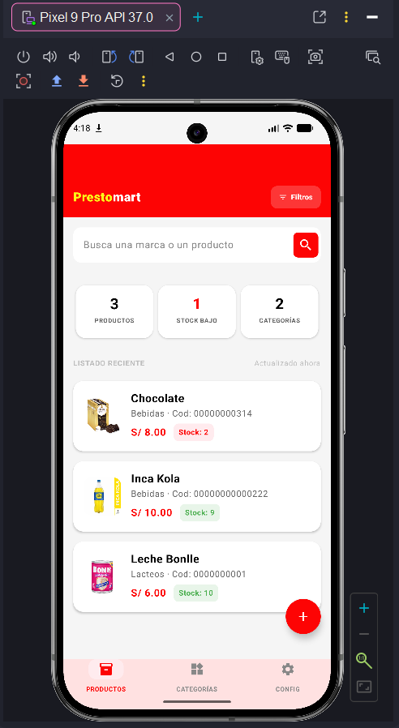
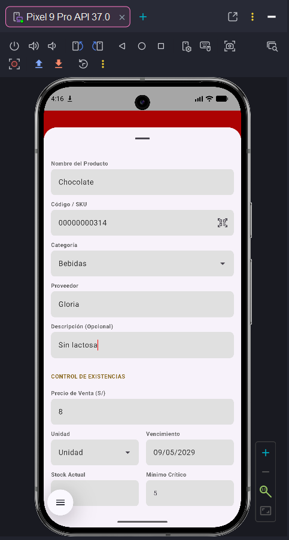
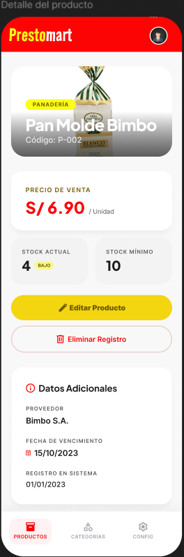
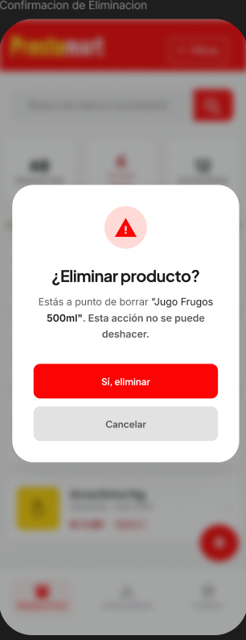
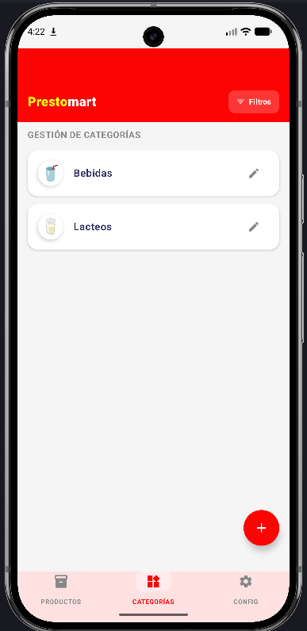
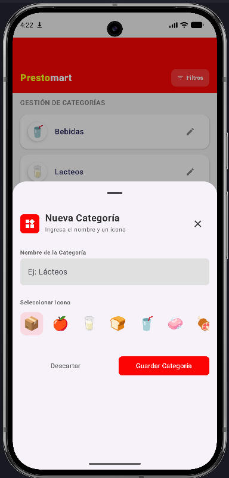

# PrestoMart-CRUD-Android

PrestoMart es un CRUD sencillo que permite controlar productos y categorías con una interfaz intuitiva y funcional, utilizando tecnología nativa.

## Instalación

1. Clonar el repositorio:
```bash
git clone https://github.com/Jhuanca2023/PrestoMart-CRUD-Android.git
```

2. Abrir en Android Studio (Ladybug o superior).
3. Sincronizar Gradle para descargar las dependencias.
4. Ejecutar en un emulador o dispositivo físico.

## Estructura del Proyecto

```text
├── 📁 app
│   └── 📁 src
│       └── 📁 main
│           ├── 📁 java/com/example/crudprestomart
│           │   ├── 📁 data (Base de datos y Repositorios)
│           │   ├── 📁 ui (Pantallas, Componentes y Temas)
│           │   ├── 📁 viewmodel (Lógica de la interfaz)
│           │   └── 📄 MainActivity.kt
│           ├── 📁 res (Imágenes, textos y estilos)
│           └── 📄 AndroidManifest.xml
├── ⚙️ build.gradle.kts (Configuración de dependencias)
└── ⚙️ settings.gradle.kts
```

## Pantallazos

### Productos
| Listado | Crear | Detalle | Eliminar |
| :---: | :---: | :---: | :---: |
|  |  |  |  |

### Categorías
| Listado | Crear |
| :---: | :---: |
|  |  |

## Tecnologías
- **Kotlin**: Lenguaje principal.
- **Jetpack Compose**: Para la interfaz moderna.
- **Room (SQLite)**: Base de datos local.
- **Navigation Compose**: Flujo entre pantallas.
- **Coil**: Carga de imágenes.

## Tarea de Investigación: Arquitectura y Conceptos Android

### Patrones de Arquitectura en Android

*   **MVVM (Model-View-ViewModel):** Separa la lógica de datos de la interfaz. El ViewModel prepara la información para que la vista solo tenga que mostrarla. Es el estándar actual.
*   **MVC (Model-View-Controller):** El controlador recibe los eventos de la vista y actualiza el modelo. Es el patrón más clásico pero menos usado hoy en Android.
*   **MVP (Model-View-Presenter):** El presentador maneja la lógica y le dice a la vista exactamente qué mostrar. Facilita las pruebas unitarias.
*   **MVI (Model-View-Intent):** Basado en un flujo de datos unidireccional. El usuario envía un "intento", el estado cambia y la vista se actualiza por completo.

### Clean Architecture
Divide el sistema en capas (Presentación, Dominio, Datos) para que el código sea fácil de mantener y no dependa de librerías externas. La lógica de negocio siempre está en el centro.

### Conceptos Fundamentales
*   **AndroidManifest.xml:** Es el archivo central donde se registra todo lo que tiene la app: sus pantallas, los permisos que pide y su nombre oficial.
*   **Gradle Scripts:** Se encarga de armar el proyecto, descargar las librerías necesarias y configurar la compilación.
*   **Carpeta res:** Contiene todo lo visual: fotos (drawables), textos traducibles (strings) y colores del sistema.

---
Cualquier duda o sugerencia sobre estas u otras arquitecturas, escribir a **josehuanca612@gmail.com**. Todo feedback es bienvenido para seguir mejorando.
